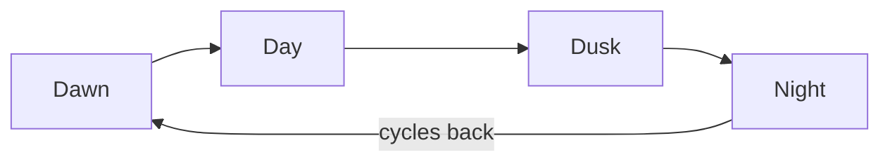

# Let Me Sleep Mod

A Godot-based mod made for the game Road to Vostok that allows the player to change the **time of day (TOD)** and **weather** by interacting with the sofa in the shelter.  
Automatically updates the game world settings and tooltip.

---

## 📦 Features
- Change **time of day** in a 4-phase cycle.
- Randomly select weather with weighted chances.
- Automatically updates the **Settings UI** and saves preferences.
- Only works when the player is in a shelter (avoids hooking in wrong contexts).
- Optional debug logging for troubleshooting.

---

## 🌅 Time of Day Cycle



---

## 🔧 Installation
1. Install the [VostokMods Mod Loader](https://modworkshop.net/mod/49779)
2. Download the .ZIP of my mod either from Github or ModWorkshop website
3. Move the downloaded .ZIP to the *mods* folder in your game installation
4. Launch the game and have fun !

---

## ▶️ Usage
- Interact with the sofa (or configured interactable) to:
  - Advance the TOD to the next phase.
  - Roll for a new weather condition.
  - Save preferences and apply them immediately.
- Tooltip will update to show **when you'll wake up** next time you sleep.

---

## ⚙️ Debug Mode
The Sofa_Leather.gs scripts use a single `DEBUG` toggle to enable/disable prints.  
To enable verbose logs:
```gdscript
const DEBUG = true


